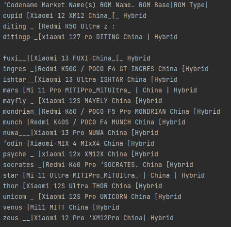
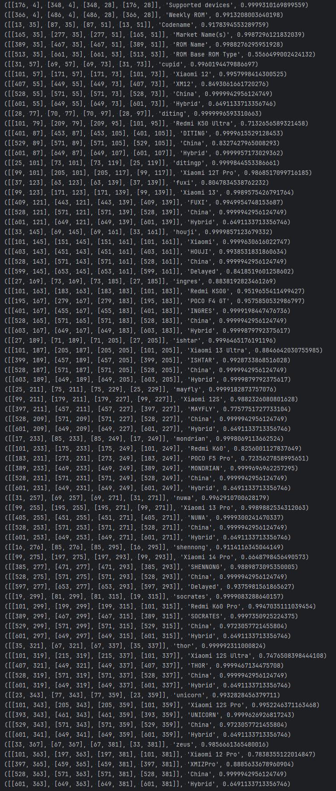

# ReadTextFromImage
OCR Program that reads text from image
Used libraries:
PIL and pytesseract, easyocr

You need to add the path to the image first and to run the file. 
Windows users must install Tesseract from https://github.com/UB-Mannheim/tesseract/wiki

--------------------------------------

